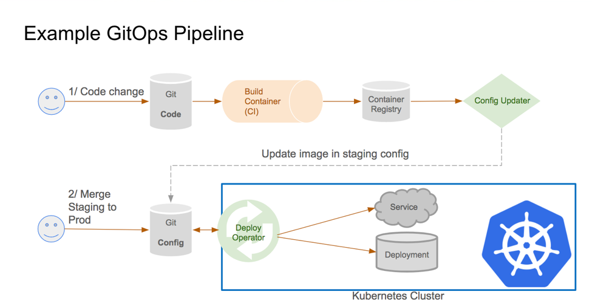

# fvf-flux
### Gitops section

This repository controls the gitops of the FVF project and it works as the diagram below.
Please check the fvf-odoo repository to see the development section of the FVF project

[#Gitops definition](https://www.weave.works/technologies/gitops/)


#### Pull pipeline




## Flux

The flux-system folder contains the flux kustomization files

Check this Flux starting guide https://fluxcd.io/docs/get-started/

## K8s
The fvf folder contains the k8s templates of the application

[x] Flux synchronize

``` flux bootstrap github \
  --owner=$GITHUB_USER \
  --repository=fvf-flux \
  --branch=main \
  --path=./clusters/eks \
  --personal \
  --components-extra=image-reflector-controller,image-automation-controller 
  --read-write-key \ 
  -n flux-system

► connecting to github.com
► cloning branch "main" from Git repository "https://github.com/awisky/fvf-flux.git"
✔ cloned repository
► generating component manifests
✔ generated component manifests
✔ component manifests are up to date
► installing toolkit.fluxcd.io CRDs
◎ waiting for CRDs to be reconciled
✔ CRDs reconciled successfully
► installing components in "flux-system" namespace
✔ installed components
✔ reconciled components
► determining if source secret "flux-system/flux-system" exists
► generating source secret
✔ public key: ssh-rsa AAAAB3NzaC1yc2EAAAADAQABAAABAQCxgJrkFrg2ofMnyFtE40Bmm1gdKBjK9z1vlvDIaS1z/RA3srn50Y4snUNIlaTd2Qbtg7FyapL8X5onXuXdqfqR25M6H0tVl0OT6JhyJRZ5c2uJQT6gOZ1nJfUkDTLpUWxuLMXuewXGAde+9vrH84Ay0kXa58jooz2CmnuxMQxokpTwf+RMpG2RTq2qijwDszeLDtPetp8lenn8bo0JEitdRBvuSbDCXV9pf3fKzhjViDMOuyRQ/MhwrksDMzssqCCR/xQ75E8CI4f655iXDlzdrqqC5S/FCZc3D8gXV4mc6kDQIQOL7m63c8NaTSflWZJfeUjZq6Kw5o9XE1+Xb7ZF
✔ configured deploy key "flux-system-main-flux-system-./clusters/eks" for "https://github.com/awisky/fvf-flux"
► applying source secret "flux-system/flux-system"
✔ reconciled source secret
► generating sync manifests
✔ generated sync manifests
✔ sync manifests are up to date
► applying sync manifests
✔ reconciled sync configuration
◎ waiting for Kustomization "flux-system/flux-system" to be reconciled
✔ Kustomization reconciled successfully
► confirming components are healthy
✔ image-automation-controller: deployment ready
✔ source-controller: deployment ready
✔ kustomize-controller: deployment ready
✔ helm-controller: deployment ready
✔ notification-controller: deployment ready
✔ image-reflector-controller: deployment ready
✔ all components are healthy

```

[x] aws credentials with IAM role settings in AWS.
`vi ~/.aws/credentials`
set the credentials in the file.
```
[default]
aws_access_key_id = ####################
aws_secret_access_key = ########################################
```

[x] S3 bucket created in AWS

Check velero documentation https://velero.io

[x] install velero
```bash
velero install --provider aws --plugins velero/velero-plugin-for-aws:v1.0.0 \
  --bucket aw-odoo-bucket --secret-file ~/.aws/credentials \
  --backup-location-config region=sa-east-1 \
  --snapshot-location-config region=sa-east-1
```

[x] create a scheduler for the namespace
```bash
velero create schedule fvf --schedule="@every 1h0m" --include-namespaces fvf-odoo --ttl 1h5m0s
```

[x] check backups

```bash
velero get backups

NAME                 STATUS      ERRORS   WARNINGS   CREATED                         EXPIRES   STORAGE LOCATION   SELECTOR
fvf-20210818145326   Completed   0        0          2021-08-18 11:53:26 -0300 -03   55m       default            <none>
fvf-20210818135326   Completed   0        0          2021-08-18 10:53:26 -0300 -03   4m ago    default            <none>
```


[x] check flux deployment

```bash
flux get kustomization
NAME            READY   MESSAGE                                                         REVISION                                        SUSPENDED 
flux-system     True    Applied revision: main/05108e957fd22851592f22171321075f07605ca7 main/05108e957fd22851592f22171321075f07605ca7   False ```

[x] check the backups

## License
[LGPL version 3 ](http://www.gnu.org/licenses/lgpl-3.0.en.html)